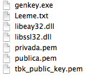
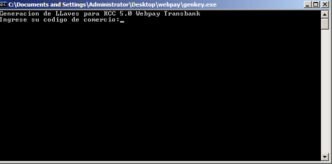
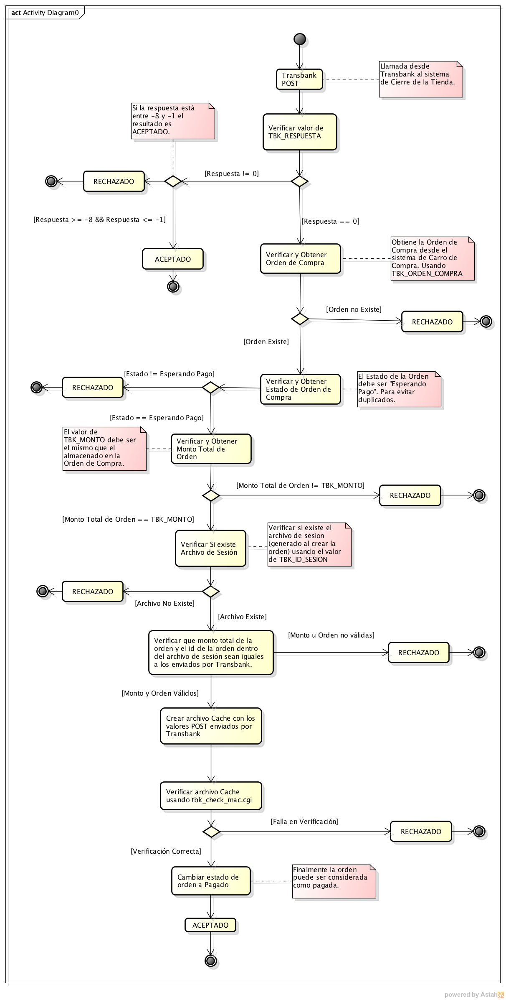
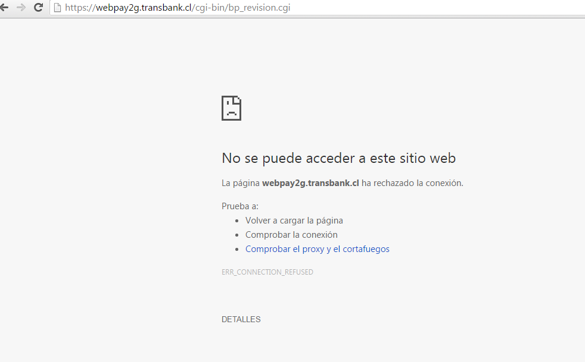

** Aviso: El proceso de integración, validación y producción por parte de TBK es una 💩. Hay que tener mucha paciencia **


# Guía de WebPay (Ruby on Rails)

Créditos de guia original:

Este repositorio contiene distintas guías para aprender a utilizar el sistema de pagos WebPay. Este documento se está creando de forma paulatina, cualquier contribución es bienvenida.

Fecha: Enero 2014, Mayo, Septiembre, Noviembre 2015, Febrero 2016, Septiembre 2017

Autor: Camilo Castro <camilo@ninjas.cl>

Versión: 1.4.0

## Licencia
<a rel="license" href="http://creativecommons.org/licenses/by-nc-sa/4.0/"></a><br /><span xmlns:dct="http://purl.org/dc/terms/" property="dct:title">Guía de Webpay</span> por <a xmlns:cc="http://creativecommons.org/ns#" href="http://www.cervezapps.cl" property="cc:attributionName" rel="cc:attributionURL">Camilo Castro</a> se distribuye bajo una <a rel="license" href="http://creativecommons.org/licenses/by-nc-sa/4.0/">Licencia Creative Commons Atribución-NoComercial-CompartirIgual 4.0 Internacional</a>.


# Integración con Ruby on Rails

Gema : https://github.com/abelorian/transbank-webpay

Basada en gema de usuario Clouw. Se le agregan los logs necesarios para el proceso de certificación


# Proceso de Certificación
Una vez configurada la gema y esté funcionando con las claves de prueba se debe comenzar el proceso de certificación. Para ésto se debe verificar que los datos detallados en el Manual de Integración KCC 60 Anexo C (p. 54-55) se cumplan a cabalidad. El comercio debe tener la siguiente información (depende del tipo de comercio): 

* Página que explique los términos y condiciones del servicio.
* Página que explique la política de devoluciones.
* Página que explique la forma de entrega.

## Paso 1 - Documento de Pre - Certificación
Transbank ha complicado el proceso de certificación exigiendo a los comercios enviar capturas de pantallas de diversas pruebas en un solo archivo pdf. Es necesario llenar un documento llamado *Evidencia Comercio.docx*, el cual está dentro del archivo descargable desde [Transbank Descargas](https://www.transbank.cl/public/productos-y-servicios/webpay/#descargas).Dentro del documento se solicitan diferentes datos y responder una serie de preguntas. Una vez llenado se debe exportar en formato *pdf* y ser enviado a *soporte@transbank.cl* con una copia al contacto comercial.

## Paso 2 - Llenar Documento Evidencia Comercio
El contenido del documento solicita la información mostrada a continuación. El documento y las preguntas pueden ir variando dependiendo del servicio contratado.

### Información de Comercio
- Nombre Comercio
- Url Comercio
- Rubro Comercio
- Rut Comercio
- Código Comercio

### Información Contacto Comercial del Comercio
- Nombre
- Mail
- Teléfono

### Información de Contacto Técnico del Comercio
- Nombre
- Mail 
- Teléfono

### Información de Cuenta de Prueba
- Usuario
- Contraseña
- URL de Login

### Adicionalmente se deben responder una serie de preguntas

- Los print de pantalla de un flujo de pago exitoso de crédito (sin cuotas), además los datos del request y response de cada método (log).
- Flujo Pago Exitoso 3 Cuotas Sin Interés
- Flujo de Pago Exitoso 4 Cuotas (normales, con interés)
- Flujo de Pago Exitoso con Tarjeta de Débito RedCompra
- Flujo de Pago Fracaso con tarjeta de crédito MasterCard
- Validación de Orden de Compra
- Validación de Página de Cierre


Para facilitar la entrega de datos se ha creado una plantilla de ejemplo disponible en [examples/Evidencia Comercio](examples/) en formato pdf, docx y pages. La cual contiene más detalles sobre como llenar la información y responder las preguntas.

También se ha creado un ejemplo de formulario html para realizar la "Evidencia 6: Validación de Orden de Compra". Puede ser [descargado de este link](code/helpers/evidencia6.html).

Es importante que en las imágenes aparezcan todos los datos de la transacción.  Transbank puede rechazar el documento si las imágenes estan incompletas o le faltan datos. Una buena herramienta para sacar capturas de pantalla de página completa es [Fireshot](http://getfireshot.com).

Una vez que soporte pruebe los datos enviarán al sitio a certificación, proceso que tardará entre 24 a 48 horas.

### Envió a Certificación
Una vez que soporte ha aprobado el envío a certificación, Luego de 24 a 48 horas certificación enviará un correo solicitando los archivos listados anteriormente. Se deben enviar de la misma forma a *certificacion@transbank.cl*.

##  Paso 3 - Paso a Producción
Certificación tardará unos días en realizar las pruebas. Una vez finalizadas enviará un correo con las instrucciones para generar las claves PEM necesarias para pasar a producción el sitio. Lamentablemente Transbank solo da instrucciones para generarlo utilizando Windows. 

**Nota**
> El paso a producción no debe tomar más de 10 días o certificación anulará el proceso y deberá comenzar desde cero.

**Nota2**
> Para ahorrar tiempo es recomendable generar los archivos pem antes de enviar el zip a certificación. De esta forma podrán descargalo fácilmente más tarde.

### Generación de llaves

#### Windows

El generador de llaves se debe descargar desde [https://www.transbank.cl/public/documentacion/descarga-kits/generador-llaves.rar](https://www.transbank.cl/public/documentacion/descarga-kits/generador-llaves.rar)

y tendrá los siguientes archivos:
<center></center>

			Figura 13: Contenidos de generador-llaves.rar

El archivo *Leeme.txt* contiene instrucciones sobre la generación de las claves y los correos donde se debe enviar posteriormente *publica.pem*. Tambíen contiene el archivo *tbk_public_key.pem* que debemos usarlo para pasar a producción el sitio.

Para generar las llaves debemos abrir el archivo genkey.exe e introducir el código de comercio asociado a la tienda.

**Nota**
> El generador de llaves dice KCC 5.0 pero servirá de todas formas para el KCC 6.0

<center></center>

						Figura 14. genkey.exe

Una vez ejecutado generará dos archivos	

* privada.pem
* publica.pem

El archivo *privada.pem* contiene la llave privada asociada al comercio, ésta debe permanecer oculta al público. El archivo publica.pem debe ser entregado a certificación.

Una vez generadas las llaves se debe enviar el archivo *publica.pem* junto al código del comercio a los correos indicados en el archivo Leeme.txt o en su defecto *certificacion@transbank.cl*.

#### Linux

Según el manual de Transbank para generar las claves pem en Linux se deben utilizar los siguientes comandos:

**Nota**
> No se ha comprobado su funcionamiento


```
# openssl genrsa -out privada.pem 4096
# openssl rsa -in privada.pem -pubout -out publica.pem

```

Tambíén se puede ejecutar el programa *genkey.exe* usando la aplicación *wine*.

```
$ sudo aptitude install wine
$ wine genkey.exe
```
La versión probada es la wine-1.4.1
bajo un sistema debian wheezy.

### Mac
Para usar el programa *genkey.exe* en Mac. Hay distintas alternativas, desde una máquina virtual con Windows. usar Bootcamp o Parallels. Pero la opción más simple sería usando *wine*. La siguiente es una guía en inglés que explica cómo instalar *wine* en Mac. [http://www.davidbaumgold.com/tutorials/wine-mac/](http://www.davidbaumgold.com/tutorials/wine-mac/). 

### Configuración Final
Finalmente se debe reconfigurar el sitio para utilizar las llaves generadas anteriormente.

Se debe reemplazar el archivo *privada.pem* por el generado con el programa. También se debe reemplazar el archivo *tbk_public_key.pem* por el que se encuentra dentro del comprimido generador-llaves.rar. Los archivos a reemplazar son:

* /cgi-bin/maestros/tbk_public_key.pem
* /cgi-bin/maestros/privada.pem

**Nota**
> Todos los archivos deben ser subidos como ASCII. En linux verificar que los archivos terminen con el retorno de carro tipo UNIX.


Ahora se debe modificar el archivo */cgi-bin/datos/tbk_config.dat* con los datos usados en producción, conservando los valores de los campos que no sean especificados en la siguiente tabla:

Campo | Valor | Comentario
------------ | ------------- | ------------
IDCOMERCIO | 5970xxxx | El Código de Comercio que Transbank dio.
SERVERTRA  | https://webpay.transbank.cl | Servidor de Producción
PORTTRA    | 443 | Puerto de Producción
URLCGITRA  | /cgi-bin/bp_revision.cgi | URL del programa de revisión en Producción.
URLCGIMEDTRA  | /cgi-bin/bp_validacion.cgi | URL del programa de validación en Producción

Quedando de la siguiente forma:

```	
IDCOMERCIO = 597073392290
MEDCOM = 2
TBK_KEY_ID = 101
PARAMVERIFCOM = 1
URLCGICOM = http://cervezapps.cl/cgi-bin/tbk_bp_resultado.cgi
SERVERCOM = 85.25.108.124
PORTCOM = 80
WHITELISTCOM = ABCDEFGHIJKLMNOPQRSTUVWXYZabcdefghijklmnopqrstuvwxyz 0123456789./:=&?_
HOST = 85.25.108.124
WPORT = 80
URLCGITRA = /cgi-bin/bp_revision.cgi
URLCGIMEDTRA = /cgi-bin/bp_validacion.cgi
SERVERTRA = https://webpay.transbank.cl
PORTTRA = 443
PREFIJO_CONF_TR = HTML_
HTML_TR_NORMAL = http://cervezapps.cl/webpay/cierre.php
```	

**Nota**
> MEDCOM = 1 puede ser usado si el comercio cuenta con SSL.

**Nota 2**
> Se debe anteponer el número 5970 como prefijo al número de comercio en IDCOMERCIO


## Paso 4 - Prueba Final
Una vez configurado el sitio en producción se hará una prueba final para comprobar que todo este funcionando correctamente, una vez que Transbank informe que el comercio ha sido agregado se debe crear una compra.

La prueba consiste en crear un producto de valor $10 CLP (10 pesos chilenos) y ejecutar una venta con un
banco real.

Se debe enviar a transbank una prueba de que el comercio efectua las ventas correctamente
usando este producto de prueba.


## Paso 5 - Limpieza, Seguridad y Otros

### Limpieza
Una vez completado el proceso de paso a producción se recomienda limpiar todos los registros de las compras realizadas en el proceso de pruebas. Usuarios, carros de compra, estadísticas, etc.

### Seguridad
Se recomienda asegurar que solamente las siguientes IPs de Transbank puedan ejecutar los archivos en */cgi-bin/*:

* 200.10.14.162
* 200.10.14.163
* 200.10.12.162
* 200.10.12.163
* 200.10.14.34
* 200.10.14.177 

### Logo de Comercio
Se puede enviar a Transbank un logotipo del comercio para mostrarse en el formulario de pago, ésto es totalmente opcional.

El logo debe tener las siguientes características:

**Formato**: GIF 
**Dimensiones**: 130 x 59 px.

## Anexos
### Anexo A: Proceso de Compra
El proceso de compra está ejemplificado con el siguiente diagrama de actividades. Este proceso es iniciado luego de que la persona ha comprado un artículo e ingresado sus datos bancarios. Es cuando Transbank informa a la tienda si una orden de compra fue exitosamente pagada o no.

[Ver en Tamaño Completo](img/1/fig15.png)



			Figura 15: Diagrama de Actividades del Proceso de Compra. Fuente: Elaboración Propia.

**Nota :**

El paso de verificación de monto se debe agregar dos ceros (00) al monto original del carro. Ya que Transbank entrega el monto con dos ceros adicionales.

Ejemplo

```php

$total_order_amount = $cart->getOrderTotalAmount();

$total_order_amount_formatted = $total_order_amount . '00';

if ($total_order_amount_formatted == $tbk_total_amount) {
	log("Amounts are Equal");
}
```

### Anexo B: Orden de los parámetros de Validación de MAC en Transacción Tipo Mall
La transacción tipo Mall recibe parámetros con diferentes nombres que la transacción normal, para la validación del MAC de tipo Mall se requiere que el archivo temporal tenga escrito los parámetros en el siguiente orden: 

	1) TBK_TIPO_TRANSACCION
	2) TBK_RESPUESTA
	3) TBK_MONTO
	4) TBK_ORDEN_COMPRA
	6) TBK_FINAL_NUMERO_TARJETA
	7) TBK_FECHA_CONTABLE
	8) TBK_FECHA_TRANSACCION
	9) TBK_HORA_TRANSACCION
	10) TBK_ID_SESION
	11) TBK_ID_TRANSACCION
	12) TBK_COD_AUT_M001
	13) TBK_TIPO_PAGO_M001
	14) TBK_NUMERO_CUOTAS_M001
	15) TBK_COD_RESP_M001
	16) TBK_MONTO_TIENDA_M001
	17) TBK_ORDEN_TIENDA_M001
	18) TBK_VCI_M001
	19) TBK_VCI
	20) TBK_MAC


Ejemplo:
	TBK_TIPO_TRANSACCION=TR_MALL&TBK_RESPUESTA=0...
	
### Anexo C: Cuentas para Ejecutar Pruebas
Al hacer pruebas siempre se deben utilizar alguna de las cuentas establecidas en el manual. A continuación se copian los datos.

Para autenticar, el usuario (RUT) a ingresar es **11.111.111-1** (nueve veces el número 1) y la clave es **123**.
Una vez autenticados, dentro del emisor podrán aceptar ó rechazar la transacción.

**Para pruebas con Tarjetas de Crédito**

| * | VISA | MASTERCARD
|--------|--------|--------|
|Número de Tarjeta|4051885600446623|5186059559590568|
|Año Expiración| Cualquiera| Cualquiera       |
|Mes Expiración|   Cualquiera     |    Cualquiera    |
|CVV|  123     | 123 |
|Resultado|     APROBADO   |  RECHAZADO      |

**Para pruebas con RedCompra**

| Número de Tarjeta| Resultado |
|--------|--------|
|   4051885600446623     |   APROBADO     |
|     5186059559590568   |     RECHAZADO   |

### Anexo D: Amazon EC2
Webpay puede tener algunas consideraciones adicionales para funcionar bien en servidores hospedados en Amazon.

#### Permisos de la VPC
Primero hay que autorizar explicitamente las IPs de Transbank en la VPC. Con el fin de evitar cualquier bloqueo de las llamadas realizadas por Transbank.

```
Ambiente de Certificación
200.10.12.55

Ambiente de Producción
200.10.14.162
200.10.14.163
200.10.12.162
200.10.12.163
200.10.14.34
200.10.14.177
```

#### Configuración de la IP Pública
La IP pública del servidor, la cual es usada en el archivo *tbk_config.dat* debe poder ser usada para llamar directamente a los archivos del cgi-bin.

**Ejemplo**

La llamada a la dirección
*http://54.xxx.yyy.zzz/cgi-bin/tbk_bp_pago.cgi*
debe mostrar un logo de Webpay y no un error de servidor como
500 o 400.

Esto se debe a que los servidores de Transbank toman la IP Pública y la llaman directamente para realizar la validación con *tbk_bp_resultado.cgi*

**Archivo tbk_config.dat**

Si Los contenidos del archivo son los siguientes

```
(...)
URLCGICOM = http://www.ejemplo.com/cgi-bin/tbk_bp_resultado.cgi
SERVERCOM = 54.xxx.yyy.zzz
(...)
```

Se debe verificar que se pueda ejecutar ambas direcciones bajo la url y la ip.
**http://www.ejemplo.com/cgi-bin/tbk_bp_resultado.cgi** y **http://54.xxx.yyy.zzz/cgi-bin/tbk_bp_resultado.cgi** 
y ambas den un resultado correcto.

### Anexo E: Solución a comportamiento errático

Cuando webpay lleva funcionando un tiempo considerable en el sitio (algunos años), puede que se presenten comportamientos erráticos en el sistema. Carros de compra no pagados, procesos no conclusos y otras eventualidades problemáticas. 
Si bien las causas pueden ser diversas y ajenas al KCC, una posibilidad es que el directorio *cgi-bin/log* este saturado. Cuando existen demasiados archivos dentro del directorio *log* el KCC puede presentar comportamientos no deseados. La solución es mover estos archivos a un directorio nuevo y dejar limpio el directorio *log* para los nuevos logs.

Para esto se deben mover los archivos a un nuevo directorio
	
	$ cd cgi-bin/log
	$ mkdir backup
	$ mv *.* backup

### Anexo F: Consideraciones al Pasar a Producción
Se debe asegurar de que el código de comercio sea el adecuado o se puede encontrar con problemas no deseados al momento de realizar compras. Como no hay forma de saber si el código de comercio está habilitado para webpay plus es mejor preguntar a Transbank directamente antes de enviar los certificados de producción.

Al configurar mal el código de comercio puede aparecer un error similar a

"No se puede acceder a la dirección https://webpay2g.transbank.cl"

<center></center>

### Anexo G: CICR y CIC
Normalmente los plugins disponibles y la configuración de esta guía operan bajo la modalidad de CICR (Cuotas iguales y conocidas RELOADED). Por lo que se recomienda de que los comercios obtengan ese tipo de contrato. El otro tipo de contrato CIC (Cuotas iguales y conocidas) obliga al comercio a implementar en el formulario de pago la selección de cuotas y enviar dos nuevos parametros a Transbank *TBK_MONTO_CUOTA* (valor de cada cuota) y *TBK_NUMERO_CUOTAS* (cantidad de cuotas). Implementar CIC implica trabajo que puede ser evitado simplemente cambiando el contrato a CICR, dejando a Transbank la tarea de calcular el monto y el número de las cuotas.

### Anexo H: TBK_CODIGO_AUTORIZACION y/o TBK_VCI
Ambos códigos pueden contener letras además de números. Por lo que su validación debe considearlos como campos alfanuméricos y no solo numéricos. Normalmente sólo tendrán números, pero en pagos con tarjetas extranjeras pueden tener letras.

### Anexo I: iOS
Si se utiliza un WebView para mostrar el formulario de pago de webpay puede arrojar error al cargar ciertas urls. Se recomienda ignorarlas en el delegate del WebView

```objective-c
- (void) webView: (UIWebView *) webView didFailLoadWithError: (NSError *) error {
    
    if([error.userInfo[@"NSErrorFailingURLStringKey"] rangeOfString:@"https://webpay3g.transbank.cl/webpaymobile/redirect.cgi?_timestamp="].location != NSNotFound ||
       
       [error.userInfo[@"NSErrorFailingURLStringKey"] rangeOfString:@"https://webpay3g.transbank.cl/webpaymobile/clock2g.cgi?_timestamp="].location != NSNotFound ||
       
       [error.userInfo[@"NSErrorFailingURLStringKey"] rangeOfString:@"https://certificacion.webpay.cl:6443/webpaymobile/redirect.cgi?_timestamp="].location != NSNotFound ||
       
       [error.userInfo[@"NSErrorFailingURLStringKey"] rangeOfString:@"https://certificacion.webpay.cl:6443/webpaymobile/clock2g.cgi?_timestamp="].location != NSNotFound) {
        
        return;
    }
...
}
